<p align="center">
  <strong>Search, filter, map, date and compare — explore your knowledge graph without writing a query.</strong><br>
  GraphExplorer is a browser-based tool for exploring knowledge graphs interactively. Load a graph from OntoCartographer Studio or any RDF file, and look at it from every angle: as lists, as a network, as a Harris matrix, on a map, in charts and on a timeline — side by side if you like.<br>
  No code, no server, and your data never leaves your computer.
</p>

<p align="center">
  
  
  
  
  
</p>

---

## What is the GraphExplorer?

A knowledge graph holds a lot of information, but it is hard to *see*: thousands of statements of the form "this find – was found in – that unit", "this unit - lies below - that unit" etc. The GraphExplorer turns such a graph into views you can browse. Search for a record, follow its connections from one to the next, filter by any of its information — its connections, its attributes, its name, and look at the same data as a collection of all information belonging to one node, a network, a stratigraphic sequence, a map, a chart or a timeline.

It reads two kinds of files: the **graph JSON** that [OntoCartographer Studio](https://github.com/oeai-dac/OntoCartographer-Studio) exports with its **Explore** button, and **RDF** files (Turtle, TriG, N-Triples, N-Quads, N3) from any other source. It was developed for archaeological data modelled with CIDOC CRM, but works with any graph.

It runs in your browser but on your own computer. Nothing is uploaded anywhere.

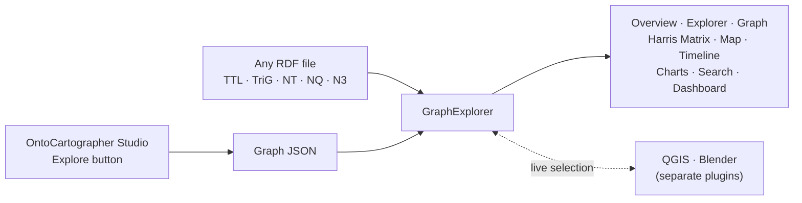

### New to knowledge graphs?

- **Knowledge graph** — data stored as connections: *things* (a site, a layer, a find) and *how they relate* ("was found in", "consists of", "lies above").
- **Node** — one thing in the graph, e.g. the find *TSP-1004-02*. Every node has a **type** (e.g. *Find*, *Stratigraphic Unit*) and can carry **attributes** — plain values such as a description, a weight or a date.
- **Connection** (or *edge*) — a link between two nodes, e.g. *TSP-1004-02 – consists of – Bronze*. The GraphExplorer shows every connection from both sides: The find *consists of* a material and the material *is material of* a find.
- **RDF** — the standard file format for knowledge graphs. **CIDOC CRM** is a widely used vocabulary for cultural heritage data.

You do not need to know any of this in detail to use the GraphExplorer — if you can read, you can explore the graph.


### Why the GraphExplorer?

- **No query language** — no SPARQL, no database; you click, filter and choose from lists
- **Nine views of the same data** — lists, network, Harris matrix, map, charts, timeline, search, and a dashboard that combines them
- **Everything linked** — select a node in one view and every other view follows
- **Made for archaeology** — Harris matrix from stratigraphic relations, maps from geometries, timelines from dates
- **Works with any graph** — reads OntoCartographer Studio exports and plain RDF; views that need data you do not have simply stay hidden
- **Handles large graphs** — tested with more than 100,000 nodes
- **Everything stays on your machine** — runs locally in your browser (no account, no cloud, no upload)

<details>
<summary><b>See all features</b></summary>

**Exploring**
- **Explorer** — list and detail view of every node, with its attributes and its connections in both directions; follow them from node to node, with a breadcrumb trail back
- **Advanced filters** — combine conditions on connections, attributes and labels
- **Graph** — start at one node and open its neighbours click by click, as a network
- **Full-text search** — across IDs, labels and all attribute values
- **Quick info** — hover over any node reference to see its type, attributes and connections without leaving the current node

**Views**
- **Overview** — node and connection types with counts, a schema of how the types relate, and the most connected nodes
- **Harris matrix** — the stratigraphic sequence, drawn from Dot-One relations (RDF-star) such as *above*, *below*, *contemporary with*, *equals*
- **Map** — every geometry (WKT) on a map, in any coordinate system, with several backgrounds or your own tiles
- **Charts** — bar charts and pivot tables: how many nodes have which value?
- **Timeline** — every date found in the graph, with one row per value of your choice (e.g. one row per stratigraphic unit)
- **Dashboard** — several views side by side in panes you can split and resize

**Working with the data**
- **Collapse pass-through nodes** — skip nodes that only link two others (e.g. a *Production* between a find and its date) and connect their neighbours directly; their attributes move along
- **Colours** — per node type and per single node; colour the matrix, the map and the timeline by any property
- **Save as JSON** — save a graph loaded from RDF as graph JSON, which opens much faster next time

**Connecting**
- **QGIS and Blender** — separate plugins connect to a running GraphExplorer and share the selection both ways

</details>

---

## Installation

### Prerequisites

To run the GraphExplorer you need Node.js (with npm):

- **Node.js 18+** (includes npm): download from <https://nodejs.org/en/download/>
- A current web browser (Firefox, Chrome, Edge, Safari, …). An internet connection is needed for the setup, and later only for map backgrounds and fonts — your data is never sent anywhere.

### Get the Project

Download the repository as a ZIP from GitHub (click **Code → Download ZIP** on the GitHub page) and unpack it, or clone it:

```bash
git clone https://github.com/oeai-dac/GraphExplorer.git
cd GraphExplorer
```

### Start

- **Windows:** double-click **`START-Graph-Explorer.bat`**
- **Mac/Linux:** open a terminal in the project folder and run `npm install` (only the first time), then `npm run dev -- --open`

On the first start, all required components are downloaded; this takes a few minutes. Afterwards your browser opens the GraphExplorer at <http://localhost:3001>.

**To stop:** on Windows, close the window titled *GraphExplorer*. On Mac/Linux, press `Ctrl+C` in the terminal.

<details>
<summary><b>Share it without installation (standalone file)</b></summary>

For colleagues who only want to try it, one command packs the whole GraphExplorer into a **single HTML file**:

```bash
npm run build:standalone     # creates GraphExplorer-standalone.html (~0.9 MB)
```

Send the file (zipped — many mail servers block `.html` attachments); the recipient double-clicks it and drops in a graph. No Node.js, no installation, no server.

If the file goes out together with a known dataset, you can answer the map's coordinate-system question in advance:

```bash
npm run build:standalone -- --epsg 4326
```

Two things differ from the installed version:

- **Map background:** a file opened by double-click cannot use OpenStreetMap (its servers require a web address the file does not have). All other backgrounds work.
- **Fonts** come from Google Fonts; without internet, the page falls back to your system fonts.

</details>

<details>
<summary><b>Run it on a web server</b></summary>

```bash
npm run build     # creates the folder dist/
```

`dist/` is a static website: put it on any web server. It needs no server-side software — the graph is still read and processed in the visitor's browser.

</details>

### Updating

Replace the project folder with the new version (or `git pull`), delete the folder `node_modules`, and start again — the first start reinstalls everything.

### Uninstall

Delete the project folder — nothing is installed outside it (apart from Node.js itself). Display settings such as your colours and dashboard layout are stored in your browser; clearing the browser's site data for `localhost:3001` removes them too.


## Quick User Guide

New to this? The [Detailed User Guide](#detailed-user-guide) walks you through every view in full.
Want to try it right away? Load the [example data](#example-data).

<b>Short overview for experienced users</b>

1. **Start** the GraphExplorer and **drop a file** onto the start page: graph JSON from OntoCartographer Studio, or RDF (`.ttl`, `.trig`, `.nt`, `.nq`, `.n3`).
2. **Overview** — node and connection types with counts, a schema of the type level, the most connected nodes. Collapse pass-through types with ⤺, the information from the neighboring nodes will be attached to each other.
3. **Explorer** — list and detail view; follow connections in both directions; combine filters on connections, attributes and labels.
4. **Graph** — pick a start node and expand its neighbours click by click.
5. **Matrix** — Harris matrix from Dot-One relations (*above*, *below*, *contemporary with*, *equals*), coloured by any property.
6. **Map** — WKT geometries in any EPSG system; categorise layers by a property; own tiles possible.
7. **Timeline** — every date found in the graph; one row per value of a property; colour and filter by values; year range.
8. **Charts** — bar chart or pivot table over any property; click a bar to filter the Explorer.
9. **Search** — full text across IDs, labels and attribute values (`/` or `Ctrl+K`).
10. **Dashboard** — several views side by side; selection and filters are shared.

Matrix, Map and Timeline only appear when the graph contains the data they need.

---

## Detailed User Guide

### Interface Overview

After loading a file, the GraphExplorer shows a header, a row of tabs — one per view — and the view itself.

| | Element | Details |
|---|---|---|
| ① | Title | The title of the loaded graph, with its number of nodes and connections |
| ② | Tabs | One tab per view. [Matrix](#4-harris-matrix), [Map](#5-map) and [Timeline](#6-timeline) only appear when the graph contains the data they need |
| ③ | [Save as JSON](#save-as-json) | Saves the graph as you currently see it as a graph JSON file |
| ④ | Load new file | Goes back to the start page to load another graph |
| ⑤ | View | The active view |
| ⑥ | [Connect QGIS / Blender](#connect-qgis-and-blender) | Connects the GraphExplorer to QGIS or Blender |

<p>
    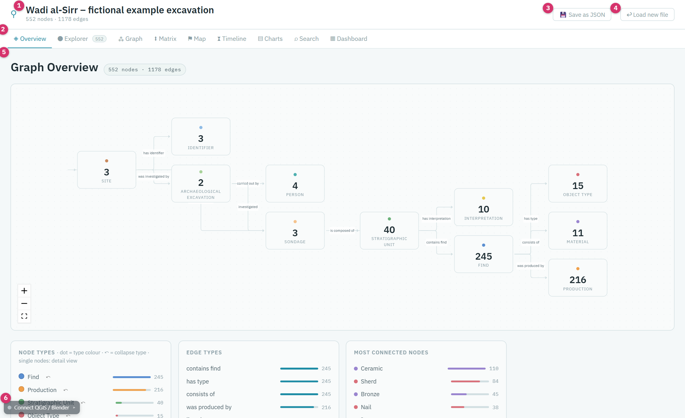
</p>

**Keyboard:** `Escape` goes back to the previous node in the Explorer · `/` or `Ctrl+K` jumps to the search.

### 0. Load Your Data

Drag a file onto the start page, or click the box to choose one.

<p>
    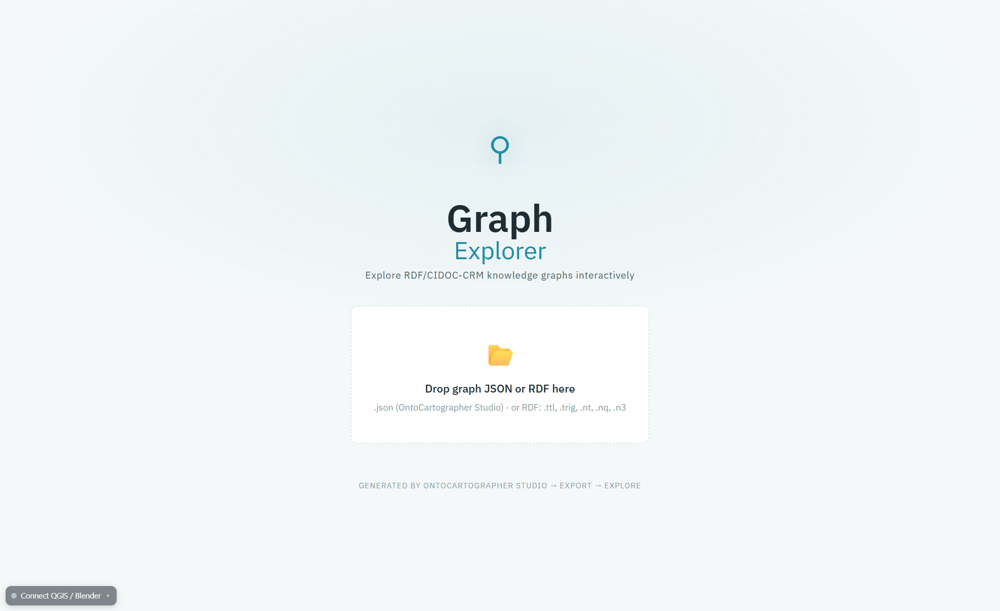
</p>

Two kinds of files are accepted:

- **Graph JSON** (`.json`) — exported from [OntoCartographer Studio](https://github.com/oeai-dac/OntoCartographer-Studio) with its **Explore** button. It carries readable names for types and connections, defined in the Studio, and both directions of every connection.
- **RDF** (`.ttl`, `.trig`, `.nt`, `.nq`, `.n3`) — from any source. The GraphExplorer converts it in your browser. Large RDF files take a moment; once loaded, [save them as JSON](#save-as-json) to open them faster next time.

Nothing is uploaded: the file is read by your browser and stays on your computer.

<details>
<summary><b>Details: how RDF is read</b></summary>

| In the RDF | In the GraphExplorer |
|---|---|
| `rdf:type` | the node's type |
| `rdfs:label`, `skos:prefLabel`, `skos:altLabel`, `dc:title`, `dcterms:title`, `foaf:name`, `schema:name` | the node's name (German labels are preferred where several languages exist) |
| a value (literal) | an attribute of the node |
| a link to another resource | a connection |
| `<< s p o >> q v` (RDF-star) | a Dot-One connection — the source of the [Harris matrix](#4-harris-matrix) |

Not supported: **RDF/XML** (`.rdf`, `.owl`, `.xml`) — convert it to Turtle or TriG first. **Named graphs** in TriG and N-Quads are read, but merged into one graph. Without the ontology, the opposite direction of a connection keeps the name of the forward direction (the Studio export names both).

</details>

### 1. Overview

The **Overview** is the first thing you see: what is in the graph, and how it blongs together.

<p>
    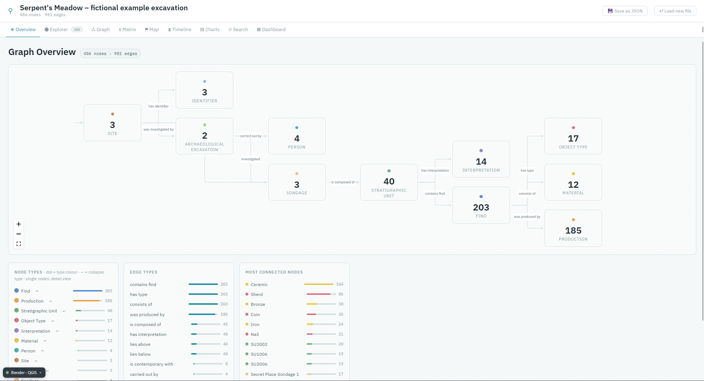
</p>

- **Schema** (top) — one box per node type with its number of nodes, and arrows for the connections between the types. It shows the structure of the data at a glance: here, a site is investigated by an excavation, is composed of sondages, which are composed of stratigraphic units, which contain finds. Click a box to list its nodes in the [Explorer](#2-explorer).
- **Node types** — every type with its count. Click a type to list its nodes in the Explorer; click its coloured dot to give it another colour.
- **Edge types** — every kind of connection with its count.
- **Most connected nodes** — the nodes with the most connections, often the central vocabulary terms (here: the materials *Ceramic* and *Bronze*). Click one to open it.

#### Collapse Pass-Through Nodes

Data modelled with CIDOC CRM often places a node *between* two things that belong together. In the example, a find is not dated directly: it *was produced by* a **Production**, and the production carries the dates. That is correct modelling, but it means the find itself has no date — the [Timeline](#6-timeline) cannot place it, and in the [Explorer](#2-explorer) the date is one click away.

Click **⤺** next to a node type to collapse it: its nodes disappear, their neighbours are connected directly, and **their attributes move to the neighbours**. After collapsing *Production*, every find carries its dates itself — and appears on the timeline.

<p>
    
</p>

Collapsed types are listed under **Collapsed**; click ✕ on one to bring it back. Collapsing only changes what you see — the loaded file is not modified.

<details>
<summary><b>Details: what happens when a type is collapsed</b></summary>

- Where a collapsed node linked two others, the new connection is named after both original ones (*A › B*), so both readings stay visible. A node that only carried values — like *Production* in the example — simply passes them on.
- If a neighbour already has an attribute of the same name, the values are joined with " · " (at most six, then "…").
- Selection, breadcrumbs and page numbers are reset, since nodes disappear.
- [Save as JSON](#save-as-json) saves the collapsed graph.

</details>

### 2. Explorer

The **Explorer** shows all information belonging to one node — its attributes and its connections — and lets you walk from node to node.

| | Element | Details |
|---|---|---|
| ① | Search field | Filters the list by ID, name and attribute values (from 2 characters) |
| ② | Advanced filters | Opens the [filters](#advanced-filters) |
| ③ | Node list | All nodes that match, 50 per page. Click one to open it |
| ④ | Type | Shows only the nodes of one type |
| ⑤ | Back and breadcrumbs | The nodes you visited. **Back** (or `Escape`) returns to the previous one; click a breadcrumb to jump back to it |

<p>
    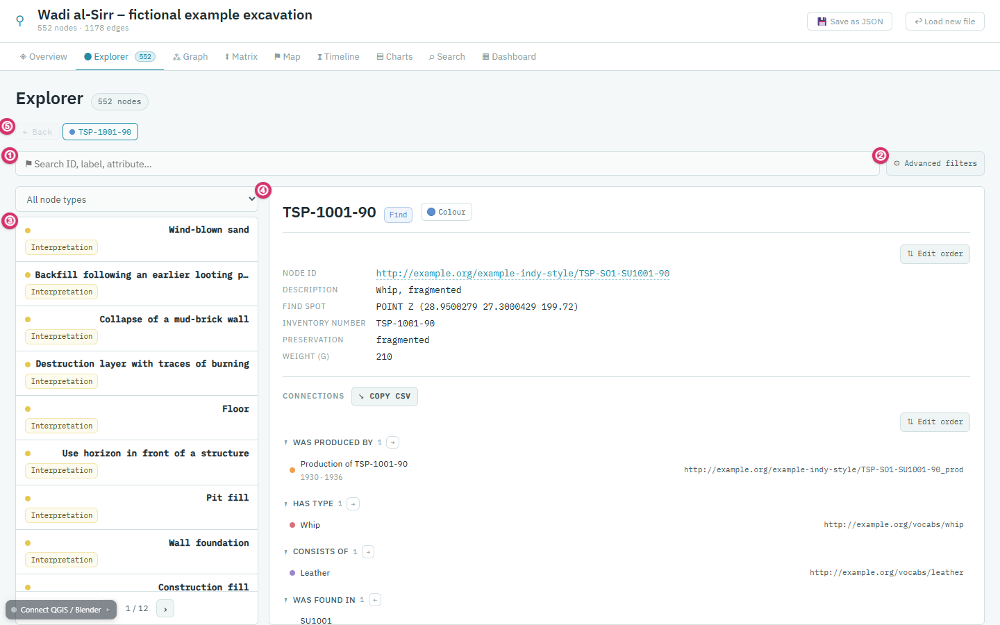
</p>

On the right, the **detail view** of the selected node:

- **Attributes** — its values: description, weight, find spot, … Long texts are shown as a block, web addresses become links, and links to images show a preview.
- **Connections** — grouped by kind and direction: **→** connections that start at this node, **←** connections that end here. Up to eight are shown per group; the rest open with a click. Under each connected node, a short line shows its most important values — e.g. the dates of a production.
- Click a connected node to open it. Your path is recorded in the breadcrumbs, so you can always go back.

Further options:

- **Colour** — gives this single node its own colour, in every view.
- **Edit order** — rearranges the attributes and connection groups. The order is remembered for all nodes of the same type.
- **Copy CSV** — copies all connections of the node, tab-separated, e.g. for a spreadsheet.

#### Advanced Filters

**Advanced filters** narrow the list by conditions. Each condition is of one of three kinds:

- **Connection** — the node is connected to a certain node, e.g. *consists of = Bronze*. Several values can be given: *consists of = Bronze or Iron*.
- **Attribute** — a value *contains*, *equals*, *is one of* or lies *between* two values, e.g. *Preservation = complete*.
- **ID/Label** — the node's ID or name.

Choose the kind and the property, enter the value and click **+ Add**. All conditions apply together (*and*): the example below shows all bronze finds that are complete. Click × on a condition to remove it.

<p>
    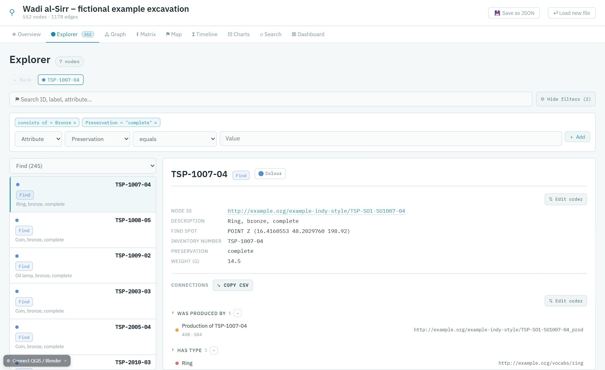
</p>

> **Tip:** The filters also apply to the [Charts](#7-charts) — filter in the Explorer, then count in the charts.

#### Quick Info

Hover over any node reference — in the list, in the connections, in search results, in the matrix, on the timeline or on the map — and a small card shows its type, attributes and connections. You can follow a trace without leaving the node you are reading.

<p>
    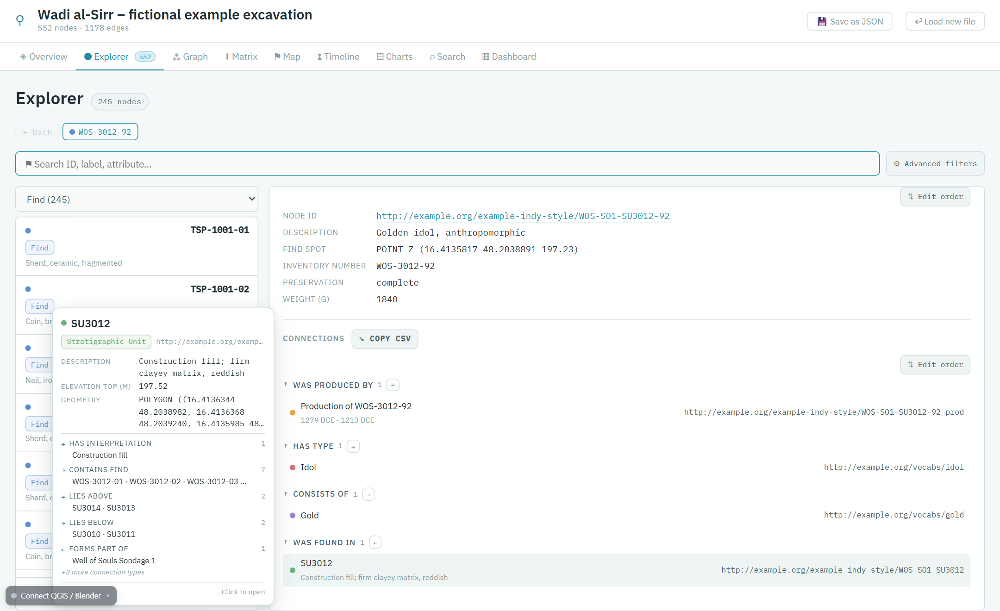
</p>

### 3. Graph

The **Graph** shows the knowledge graph as what it is: a network of nodes and connections. The Explorer shows one node at a time; here you see the surroundings of several nodes at once — and whether two finds are linked through the same unit.

**Choose a start node:** search for it by name or ID, or start with one of the most connected nodes. A node selected in another view is taken over automatically (or with **⟲ Use selection**).

<p>
    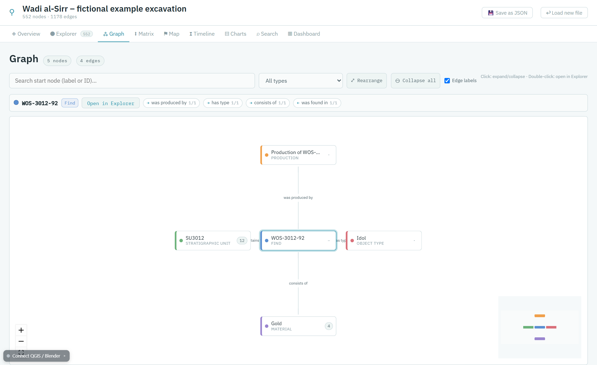
</p>

**Open the network:** click a node to show its neighbours, click again to hide them. The small box on each node tells you in advance what a click does: a number (that many neighbours are not shown yet), `−` (open), or a faint dot (open, all neighbours already visible).

<p>
    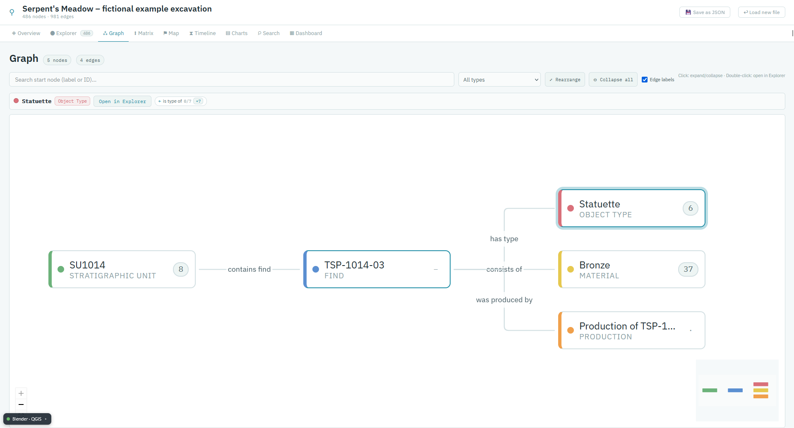
</p>

- **Drag** nodes to arrange them; existing nodes stay where they are when new ones appear.
- **⤢ Rearrange** arranges the visible part neatly once; **⊖ Collapse all** goes back to the start node.
- **Double-click** a node (or **Open in Explorer**) to open it in the Explorer.
- The bar above the network lists the connections of the selected node, with how many are shown (e.g. *is material of 9/9*).

<details>
<summary><b>Details: large graphs</b></summary>

A single node can have thousands of connections — a material, for instance, is linked to every find made of it. So at most 25 neighbours per kind of connection are opened at first; the bar above the network offers **+25** and **all** for the rest. The canvas holds up to 1500 nodes. Connection labels are hidden from 150 connections on, as they would no longer be readable; the **Edge labels** switch turns them off earlier.

</details>

### 4. Harris Matrix

The **Matrix** draws the stratigraphic sequence as a Harris matrix: later units at the top, earlier ones below.

<p>
    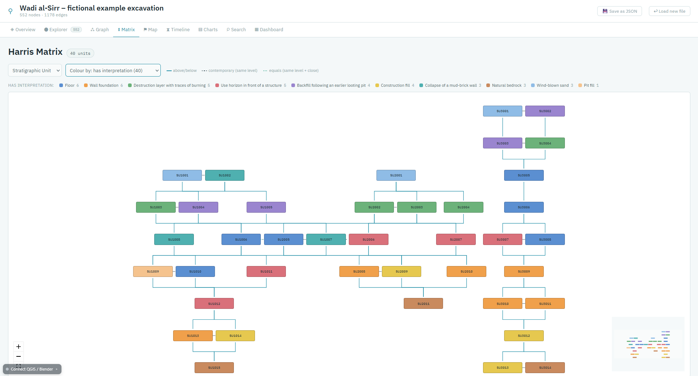
</p>

It is built from **Dot-One relations** — connections that carry a type of their own, written as RDF-star in RDF (e.g. *SU1001 – has physical relation to – SU1002*, of type *above*). In OntoCartographer Studio they are created as [Dot-One properties](https://github.com/oeai-dac/OntoCartographer-Studio#dot-one-properties-rdf-star). The tab appears only when the graph contains such relations.

- **Type** — the node type the matrix is drawn for. It is suggested automatically.
- **Colour by** — colours the units by a property, e.g. by their interpretation; the legend names each value and its count. Click a legend entry to list those units in the Explorer.
- **Click** a unit to open it in the Explorer; **hover** for the quick info.

| Line | Relation |
|---|---|
| solid | *above* / *below* — the lower unit is earlier |
| dashed | *contemporary with* — drawn at the same level |
| dotted | *equals* — the same unit recorded twice, drawn side by side |
| dashed red | a relation value the matrix does not know |

<details>
<summary><b>Details: recognised relation values</b></summary>

| Value | Meaning |
|---|---|
| `above`, `over`, `ueber`/`über`, `oben` | lies above, is later |
| `below`, `under`, `unter`, `unten` | lies below, is earlier |
| `contemporary with`, `same time`, `zeitgleich`, `gleichzeitig` | same level |
| `equals`, `same as`, `corresponds to`, `entspricht` | same unit |

When colouring, the 20 most frequent values get a colour of their own; rarer values and units without a value are grey. A unit with several values takes the colour of its most frequent one.

</details>

### 5. Map

The **Map** shows every geometry in the graph — points, lines and polygons — on a map. The tab appears only when the graph contains geometries.

Geometries are stored as text in the WKT format (e.g. `POINT (16.37 48.21)`), and WKT does not say which **coordinate system** it uses. So the first time you open the map, it asks:

<p>
    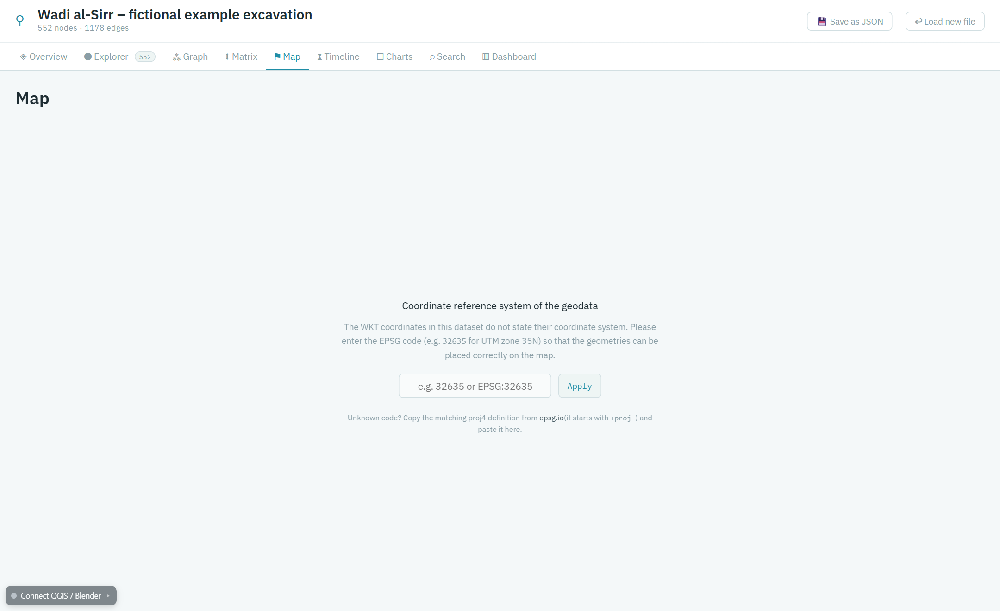
</p>

Enter the **EPSG code** of your data — e.g. `4326` for latitude/longitude (WGS84), `32635` for UTM zone 35N, `31287` for Austria (MGI / Austria Lambert). For a code the GraphExplorer does not know, copy its *proj4* definition from [epsg.io](https://epsg.io) and paste it instead. You can change the system at any time with **Change EPSG**.

<p>
    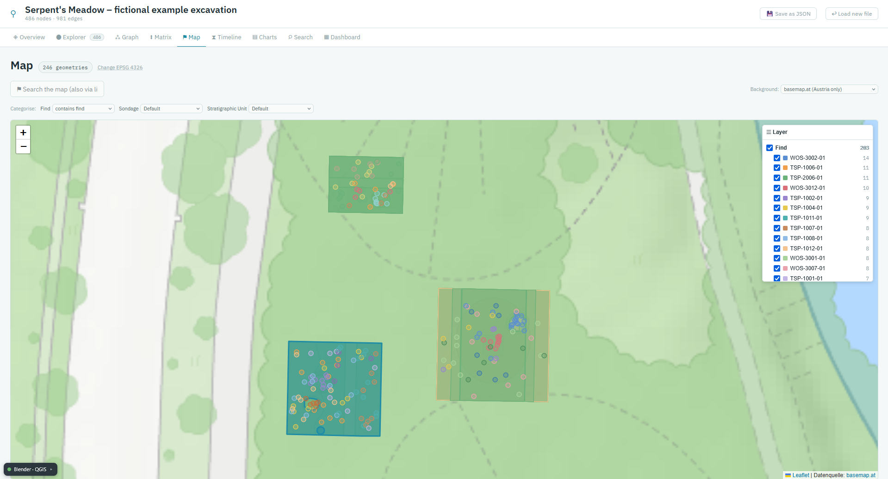
</p>

- **Layers** (top right) — one layer per node type; switch them on and off.
- **Categorise** — splits a layer by a property, e.g. finds by material; each value gets its own colour and its own switch.
- **Search the map** — finds geometries by name, ID or value, also through connected nodes: searching *Gold* finds the find spots of all gold finds. **Mark all** highlights every match.
- **Background** — a light grey world map, satellite images, OpenStreetMap, maps of Austria (basemap.at), your own tiles, or none.
- **Click** a geometry to open its node in the Explorer; **hover** for the quick info. A node selected elsewhere is highlighted and brought into view.

<details>
<summary><b>Details: coordinate systems, backgrounds and your own tiles</b></summary>

**Coordinate systems:** a small built-in table covers common codes (including 4326, 3857, 31287, 4258, 3035) and all UTM zones (WGS84 and ETRS89). Anything else works with a proj4 definition. If geometries appear in the wrong place, the coordinate system is wrong.

**Geometries that cannot be read** (e.g. cut off during export) are counted in the header and left out.

**Your own tiles:** instead of an online background, you can use your own raster — usually the better basis for excavation plans or orthophotos. Create a tile pyramid, e.g. in QGIS with *Processing → Generate XYZ tiles (Directory)* or with `gdal2tiles`, and put the folder `tiles` next to the [standalone file](#installation) (or into the project folder):

```
tiles\{z}\{x}\{y}.png
```

Then choose **Own tiles** as background. This works fully offline. The map detects how deep your tiles go and enlarges the last level instead of loading empty tiles.

</details>

### 6. Timeline

The **Timeline** places every date it finds in the graph on a time axis. The tab appears only when the graph contains dates.

<p>
    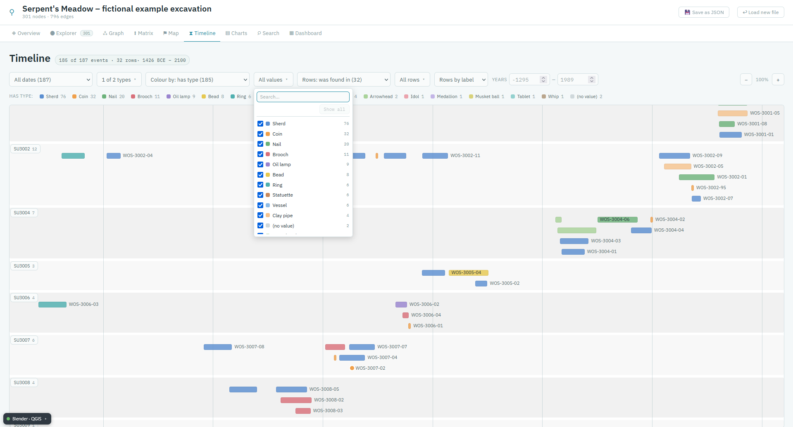
</p>

The screenshot shows the finds of the example, after [collapsing *Production*](#collapse-pass-through-nodes): one row per stratigraphic unit, each find coloured by its material.

From left to right:

- **Dates** — which date is shown: one of the date properties, a from–to pair, or **All dates**.
- **Types** — which node types are shown.
- **Colour by** — colours the bars by a property, e.g. by material. The list next to it shows only some of the values — *only ceramic and coins*. The legend switches values on and off as well.
- **Rows** — one row per value of a property, e.g. *Rows: was found in* gives one row per stratigraphic unit. Connections can be chosen as well as attributes.
- **Rows by** — sorts the rows by label, by count, or by time (earliest first).
- **Years** — limits the time span. Negative years are BCE; an empty field stays open.
- **− / +** — zooms the time axis.

Exact dates (a day, a month, a year) appear as points; spans (a decade, a century, from–to) as bars. Overlapping dates within a row are stacked, never drawn on top of each other. Click a bar to open its node in the Explorer; hover for the quick info.

<details>
<summary><b>Details: which dates are recognised</b></summary>

- Years and full dates in common notations: `1989`, `1989-07`, `1989-07-14`, `-320`, `320 BCE`, `320 v. Chr.`, `18th century`, `1890s`, `1880–1895`, `ca. 1500`, …
- **From–to pairs** of attributes are combined into one span, e.g. `start_date` / `end_date`, `begin_of_the_begin` / `end_of_the_end`, `from` / `to`, `earliest` / `latest`.
- Only attributes whose name suggests a date (*date*, *year*, *period*, *begin*, *end*, …) are considered for plain numbers — so a weight of *1840* is not read as a year.
- A span that only partly falls into the chosen years is still shown.

</details>

### 7. Charts

The **Charts** answer one question: *how many nodes have which value?*

<p>
    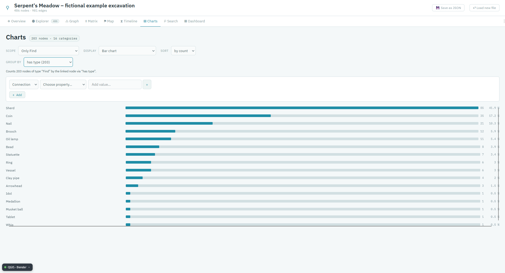
</p>

1. **Scope** — all nodes, or only one type (here: only finds). The filters below narrow it further, exactly like the [advanced filters](#advanced-filters) of the Explorer.
2. **Group by** — the property to count by, e.g. *consists of*. The number in brackets tells how many nodes in the scope have a value for it. A sentence below the selection says in plain words what the chart shows.
3. **Display** — a **bar chart**, or a **pivot table** that crosses two properties.

<p>
    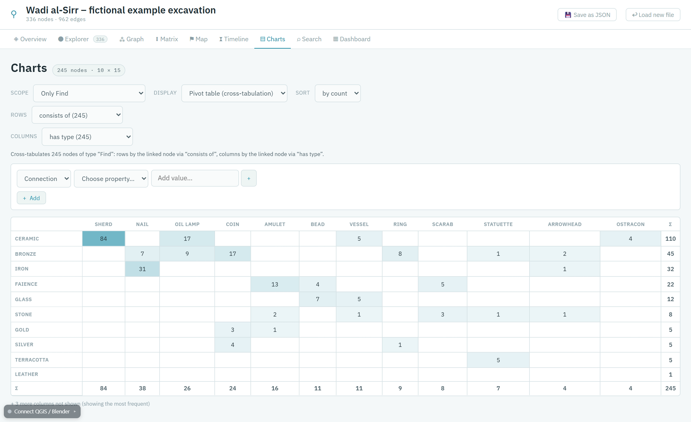
</p>

The pivot table above crosses object type and stratigraphic unit: SU3002 holds the most sherds, SU1006 the most coins.

- **Click** a bar or a table cell to list exactly those nodes in the Explorer.
- **Sort** by count or by label (labels in natural order: *SU 2* before *SU 10*; dates chronologically).
- For **dates**, a time resolution appears: per year, per decade or per century.

<details>
<summary><b>Details: limits</b></summary>

The bar chart shows up to 30 bars, the pivot table up to 20 rows and 12 columns — always the most frequent; the rest is counted below. **(no value)** collects the nodes without a value; it cannot be clicked. A property with a value of its own for almost every node (an inventory number, a geometry) gives no useful chart — the GraphExplorer says so when you choose it.

</details>

### 8. Search

The **Search** looks for a word in all IDs, names and attribute values. Type at least two characters; the results are grouped by type. Narrow it to one type with the menu on the right.

<p>
    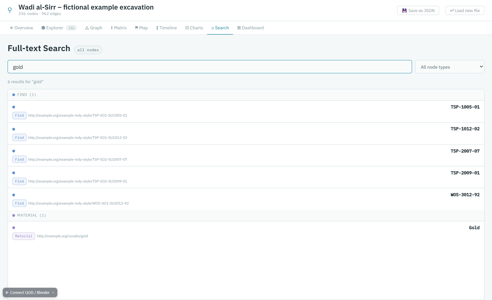
</p>

Click a result to open it in the Explorer. From anywhere in the GraphExplorer, `/` or `Ctrl+K` jumps straight to the search field.

> The search field in the Explorer filters the list; this tab searches across everything and shows up to 300 results.

### 9. Dashboard

The **Dashboard** shows several views side by side — for example the Explorer, the map and the matrix at once.

<p>
    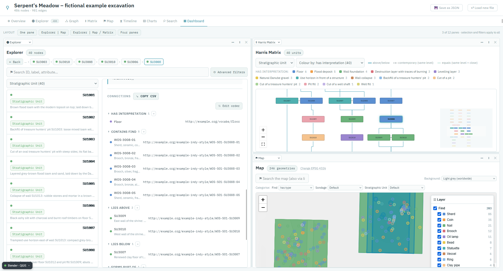
</p>

- **Layout** (top) — ready-made arrangements: one pane, Explorer │ Map, Explorer │ Map ╱ Matrix, four panes.
- **Choose a view** with the menu at the top left of each pane.
- **Split** a pane with `⬌` (side by side) or `⬍` (one above the other), **close** it with `✕`.
- **Resize** by dragging the line between two panes; double-click the line to split evenly.

All panes share the same selection and filters: click a stratigraphic unit on the map, and the Explorer opens it and the matrix highlights it. The arrangement is remembered by your browser. Up to 12 panes are possible.

### Colours

Every node type gets a colour of its own, the most frequent type first. You can change it:

- **for a whole type** — click its coloured dot in the [Overview](#1-overview);
- **for a single node** — **Colour** in its [detail view](#2-explorer).

These colours are used in every view and are remembered by your browser. In the Matrix, the Map and the Timeline you can also colour by a property instead (*Colour by*, *Categorise*).

### Save as JSON

**Save as JSON** (③ in the [Interface Overview](#interface-overview)) downloads the graph as you currently see it — including [collapsed types](#collapse-pass-through-nodes) — as graph JSON. Use it

- to open an RDF file faster next time (graph JSON needs no conversion),
- to pass on a collapsed, simpler version of a graph.

The file is named after the graph title; if types are collapsed, `-collapsed` is added.

### Connect QGIS and Blender

The GraphExplorer can be linked to **QGIS** and **Blender**: select a node here, and the corresponding feature or object is selected there — and the other way round. Both applications can be connected at the same time.

The plugins for [QGIS](https://github.com/oeai-dac/GraphExplorer_QGIS) and [Blender](https://github.com/oeai-dac/GraphExplorer_Blender) are separate projects and are installed in the respective application. They need a running GraphExplorer:

1. Start the GraphExplorer and load your graph.
2. In QGIS or Blender, copy the connection address from the plugin.
3. Click **Connect QGIS / Blender** at the bottom left of the GraphExplorer, paste the address, and click **Connect**.

<p>
    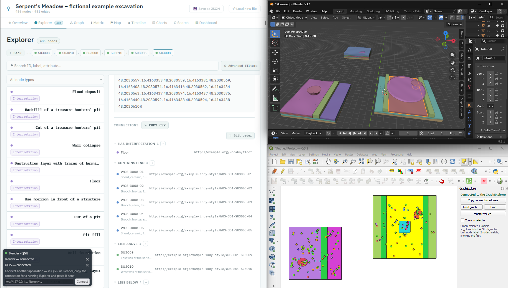
</p>

---

## Example Data

The folder `0_exampleData/` contains a small, **entirely fictional** excavation that uses every view of the GraphExplorer: *Serpent's Meadow*, a stretch of Danube floodplain, with two sites, *The Secret Place* and *The Well of Souls*. It has three sondages, 40 stratigraphic units and 203 finds, from the Late Bronze Age to modern times. The same excavation also comes as GIS layers for QGIS and as 3D bodies for Blender, so you can try the connection to both through their respective plugins.

1. [Start the GraphExplorer](#start).
2. Drop `0_exampleData/GraphExplorer_Example.json` onto the start page.
3. When the map asks for the coordinate system, enter `4326`.
4. In the [Overview](#1-overview), collapse *Production* with ⤺. Then the finds appear on the timeline.

| File | Content |
|---|---|
| `GraphExplorer_Example.json` | The example graph (graph JSON, English labels with German translations) |
| `GraphExplorer_Example.gpkg` | To connect the GraphExplorer with QGIS through the plugin **GraphExplorer Link for QGIS**: a GeoPackage containing sondages, plans of the stratigraphic units and find spots (EPSG:32633) |
| `GraphExplorer_Example.obj` + `.mtl` | To connect the GraphExplorer with Blender through the add-on **GraphExplorer Link for Blender**: an .obj file with one 3D body per stratigraphic unit and a marker per find, named like the nodes in the graph |
| `make_example.py` | The Python script that generated all of them |

All sites, people, units, finds and dates are invented.

<details>
<summary>Recreating the files</summary>

Run `python make_example.py GraphExplorer_Example.json`. The script needs `numpy`, `shapely` and `pyproj`. It writes the GeoPackage only if GDAL's Python bindings are available. The simplest way is QGIS's own Python:

```
"C:\Program Files\QGIS 3.44.4\bin\python-qgis.bat" make_example.py GraphExplorer_Example.json
```

In Blender, use *File → Import → Wavefront (.obj)* with the default axis settings. The coordinates are metres east and north of E 605211 / N 5339827 (UTM 33N) and heights above sea level, so they line up with the GeoPackage.
</details>


---

## Troubleshooting

### Installation and Start

**"node is not recognized" / Node.js was not found**
Node.js is not installed or not in your PATH. Install Node.js 18+ from <https://nodejs.org/en/download/> and start again.

**The browser does not open, or shows an error**
Look at the window opened by `START-Graph-Explorer.bat` (or your terminal): it prints the address, usually <http://localhost:3001>. If port 3001 is in use, the GraphExplorer takes the next free one and prints it there.

**Something behaves oddly after an update**
Delete the folder `node_modules` and start again (see [Updating](#updating)).

### Loading

**"Please drop a .json file or an RDF file"**
RDF/XML (`.rdf`, `.owl`, `.xml`) is not supported — convert it to Turtle or TriG first, e.g. with an RDF converter.

**A large RDF file takes long to load**
Load it once and use [Save as JSON](#save-as-json); the JSON file opens much faster.

### Views

**The Matrix, Map or Timeline tab is missing**
The graph contains no Dot-One relations, no geometries or no dates, respectively. These tabs only appear when there is something to show.

**The finds do not appear on the timeline**
Their dates are probably attached to another node — e.g. a production. [Collapse](#collapse-pass-through-nodes) that type in the Overview.

**The geometries are in the wrong place, or the map is empty**
The coordinate system is wrong. Click **Change EPSG** and enter the right code.

**The map background shows "Access blocked"**
OpenStreetMap does not deliver to a file opened by double-click ([standalone file](#installation)). Choose another background.

**My colours or dashboard layout are gone**
They are stored in your browser. A different browser, a private window or clearing the site data starts afresh.

---

## License

GPL 3.0 or later — see [LICENSE](LICENSE).

---

## AI Assistance

The GraphExplorer was developed with the AI coding assistant [Claude Code](https://claude.com/claude-code) by Anthropic. Claude was used to write and refactor code, to review it against the documentation, and to help with drafting the documentation. The concept, the requirements and the testing come from the author; every change was reviewed before it was adopted.

---

## Acknowledgments and Credits

Developed for digital archaeology and cultural heritage data management, as a companion to [OntoCartographer Studio](https://github.com/oeai-dac/OntoCartographer-Studio).
